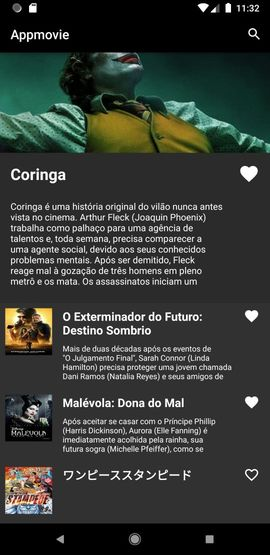
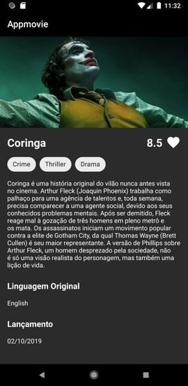

# Atividade técnica de desenvolvimento Android

## Autor: Jorge Rossi

## Desafio

* Desenvolver um aplicativo Android para visualização de filmes

## Tecnologias utilizadas

* **Kotlin** como linguagem de programação
* **MVVM** como padrão de projeto
* **Retrofit2** para requisições na API
* **Picasso** para visualização de imagens
* **Room** para persistência dos filmes favoritos

## Layout

### Tela principal 

  

### Tela de detalhes do filme

### Tela de pesquisa de filmes

